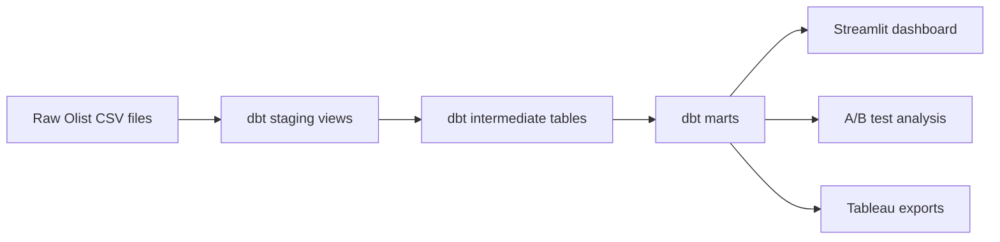

# RetailPulse - Sales Analytics & Experimentation Platform

RetailPulse is an end-to-end retail analytics engineering portfolio project. It
ingests raw Olist e-commerce CSVs, models them with dbt and DuckDB, calculates
business KPIs, simulates a statistically rigorous discount A/B test, serves a
Streamlit dashboard, and exports Tableau-ready datasets.

## Problem Statement

Retail teams need trustworthy sales, customer, product, and operations metrics
before they can make pricing or campaign decisions. This project demonstrates
how to turn messy e-commerce source data into documented analytical marts,
validate those marts with automated tests, and use them for BI and experiment
analysis.

## Dataset

Dataset: Olist Brazilian E-Commerce public dataset.

Place the CSV files in:

```text
data/raw/olist/
```

Expected files include:

```text
olist_orders_dataset.csv
olist_order_items_dataset.csv
olist_customers_dataset.csv
olist_products_dataset.csv
olist_order_payments_dataset.csv
olist_order_reviews_dataset.csv
olist_sellers_dataset.csv
olist_geolocation_dataset.csv
product_category_name_translation.csv
```

Olist has no real discount campaign or experiment assignment. The A/B test in
this project is explicitly simulated on top of historical customer revenue.

## Architecture



Layer responsibilities:

- `staging`: one-to-one cleaned source views.
- `intermediate`: grain control, joins, and reusable business logic.
- `marts`: business-facing facts, dimensions, and aggregates.
- `analysis`: simulated discount campaign A/B test.
- `app`: Streamlit dashboard.
- `tableau`: CSV and Parquet export script.

See [docs/architecture.md](docs/architecture.md) for lineage and design
decisions.

## Project Structure

```text
RETAIL-DASHBOARD-ABTEST/
├── README.md
├── .gitignore
├── requirements.txt
├── data/
│   └── raw/olist/
├── dbt/
│   ├── dbt_project.yml
│   ├── profiles.yml
│   ├── models/
│   │   ├── staging/
│   │   ├── intermediate/
│   │   └── marts/
│   └── tests/
├── analysis/
│   └── ab_test.py
├── app/
│   └── streamlit_app.py
├── tableau/
│   └── export_for_tableau.py
├── tests/
│   └── test_ab_test.py
└── docs/
    └── architecture.md
```

## Setup From Scratch

1. Clone the repository.

```bash
git clone <repo-url>
cd retail-dashboard-abtest
```

2. Create and activate a virtual environment.

```bash
python -m venv .venv
source .venv/bin/activate
```

3. Install dependencies.

```bash
pip install -r requirements.txt
```

4. Add the Olist CSV files.

```bash
mkdir -p data/raw/olist
```

Download the Olist dataset and place the expected CSVs in `data/raw/olist/`.

5. Build the dbt models.

```bash
dbt debug --project-dir dbt --profiles-dir dbt
dbt run --project-dir dbt --profiles-dir dbt
dbt test --project-dir dbt --profiles-dir dbt
```

6. Run the simulated A/B test.

```bash
python analysis/ab_test.py
```

7. Launch the dashboard.

```bash
streamlit run app/streamlit_app.py
```

8. Export Tableau-ready files.

```bash
python tableau/export_for_tableau.py
```

## Main Outputs

dbt creates a local DuckDB database:

```text
retailpulse.duckdb
```

The A/B test writes:

```text
analysis/outputs/ab_test_summary.json
analysis/outputs/ab_test_revenue_distribution.html
```

The Tableau exporter writes:

```text
tableau/exports/tableau_sales_dataset.csv
tableau/exports/tableau_sales_dataset.parquet
tableau/exports/manifest.json
```

## Example Results

Latest verified local run:

```text
dbt run: 21/21 models passed
dbt test: 93/93 tests passed
fct_orders: 99,441 rows
fct_sales: 110,197 rows
dim_customer: 93,358 rows
delivered gross revenue: 15,419,773.75
```

Simulated A/B test output:

```text
Control mean: 166.68
Treatment mean: 176.66
Relative lift: 5.98%
p-value: 9.607e-11
95% confidence interval: [6.95, 12.99]
Cohen's d: 0.0424
Effect size classification: negligible
```

The result is statistically significant but practically small. The script prints
a plain-English recommendation explaining that this result alone would not
justify a business decision without stronger intervention design or additional
context.

## StreamLit Screenshots
screenshots are here after opening the local dashboard:


## Tableau Screenshots


## 📊 Tableau Dashboard

View the interactive dashboard here:

[Tableau Dashboard](https://public.tableau.com/app/profile/hateem.khurram/viz/RetailPulseSalesAnalyticsDashboard/RetailPulseSalesAnalyticsDashboard)


## Important Talking Points

- `customer_unique_id` is the correct customer identity for RFM, churn, and
  experiment randomization; `customer_id` is order-level in Olist.
- Payments and reviews are summarized before joining to facts to avoid fanout.
- Delivered revenue and delivery-quality metrics are treated separately because
  some delivered orders have missing delivery timestamps.
- The A/B test is synthetic because Olist has no real experiment flag.
- Tableau exports include both normalized marts and a wide dataset for BI users.

## Environment Variables

Optional environment variables:

```bash
export RETAILPULSE_DUCKDB_PATH="retailpulse.duckdb"
export RETAILPULSE_RAW_OLIST_PATH="data/raw/olist"
export RETAILPULSE_AB_TEST_OUTPUT_DIR="analysis/outputs"
export RETAILPULSE_TABLEAU_EXPORT_DIR="tableau/exports"
```
