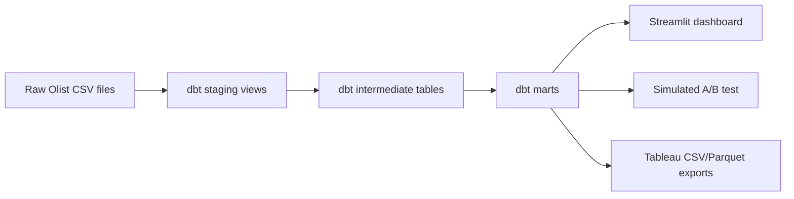

# RetailPulse Architecture

RetailPulse is a local analytics engineering project that models raw Olist
Brazilian e-commerce data into tested dbt marts, then uses those marts for
dashboarding, statistical analysis, and Tableau exports.

## Data Flow

## Layers

### Raw Data

Raw files live under `data/raw/olist/` and are intentionally ignored by Git
because the public dataset should be downloaded separately. The expected source
is the Olist Brazilian E-Commerce public dataset.

### Staging

Staging models are one-to-one with source files and are materialized as views.
They only perform light cleaning:

- type casting
- casing and whitespace normalization
- typo correction for Olist product columns such as `product_name_lenght`
- synthetic event keys where the raw table does not provide a reliable unique
  identifier

No business metrics are calculated in staging.

### Intermediate

Intermediate models control grain and encode reusable business logic:

- `int_payments__order_summary` aggregates split payment rows to order grain.
- `int_reviews__order_summary` aggregates duplicate review rows to order grain.
- `int_order_items__enriched` keeps order item grain while adding product and
  seller attributes.
- `int_orders__enriched` creates a stable order-grain analytical table.
- `int_customers__rfm_inputs` calculates person-level RFM inputs from delivered
  orders.

This layer prevents fanout from one-to-many tables before marts are built.

### Marts

Marts are business-facing tables:

- `fct_sales`: delivered order item fact table.
- `fct_orders`: order-grain fact table across all order statuses.
- `dim_customer`: person-level customer dimension with RFM segment and churn
  flag.
- `dim_product`: product dimension with delivered-sales rollups.
- `dim_seller`: seller dimension with delivered-sales rollups.
- `agg_daily_sales`: daily KPI aggregate for BI and dashboard trends.

## Key Design Decisions

### Customer Identity

Olist has both `customer_id` and `customer_unique_id`. `customer_id` is unique
per order, while `customer_unique_id` represents the actual person. RetailPulse
uses `customer_unique_id` for RFM, churn, customer counts, and the simulated A/B
test randomization unit.

### Payment Grain

`order_payments` can contain multiple rows per order. Payments are aggregated to
order grain before joining to order facts so revenue is not multiplied.

### Review Grain

Reviews are not reliably unique by `review_id` or `order_id`. The staging layer
creates a review event key, and the intermediate layer summarizes reviews to
order grain before joining.

### Delivered Revenue

`fct_sales` includes delivered order items only. `fct_orders` retains all order
statuses so operational status analysis remains possible.

### Delivery Data Quality

Eight delivered orders have missing customer delivery timestamps. These orders
remain in revenue metrics, but `has_valid_delivery_timing` prevents invalid or
missing operational dates from contaminating delivery KPIs.

### Churn

The dataset is historical and static, so churn is defined relative to the max
purchase date in the dataset. Customers with no purchase in the last 180 days
are flagged as churned.

### A/B Test Simulation

Olist does not contain real campaign or experiment data. The A/B test module
therefore simulates a discount experiment at customer grain. This is clearly
labeled as synthetic and should be presented as an experimentation engineering
demonstration, not as a historical Olist experiment.

## Quality Controls

- dbt model tests cover uniqueness, non-null fields, relationships, accepted
  values, and custom business assertions.
- Python modules use typed function signatures and module/function docstrings.
- The Streamlit app and scripts handle missing data with clear messages.
- Tableau exports include a manifest with row counts for auditability.
